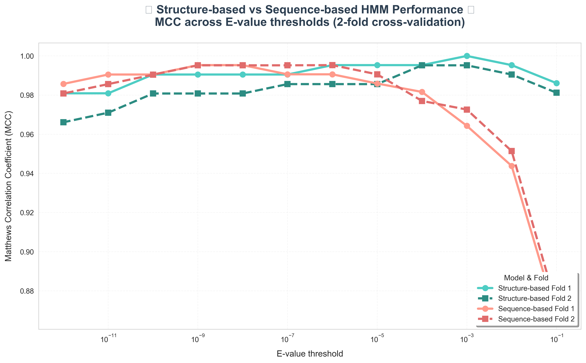
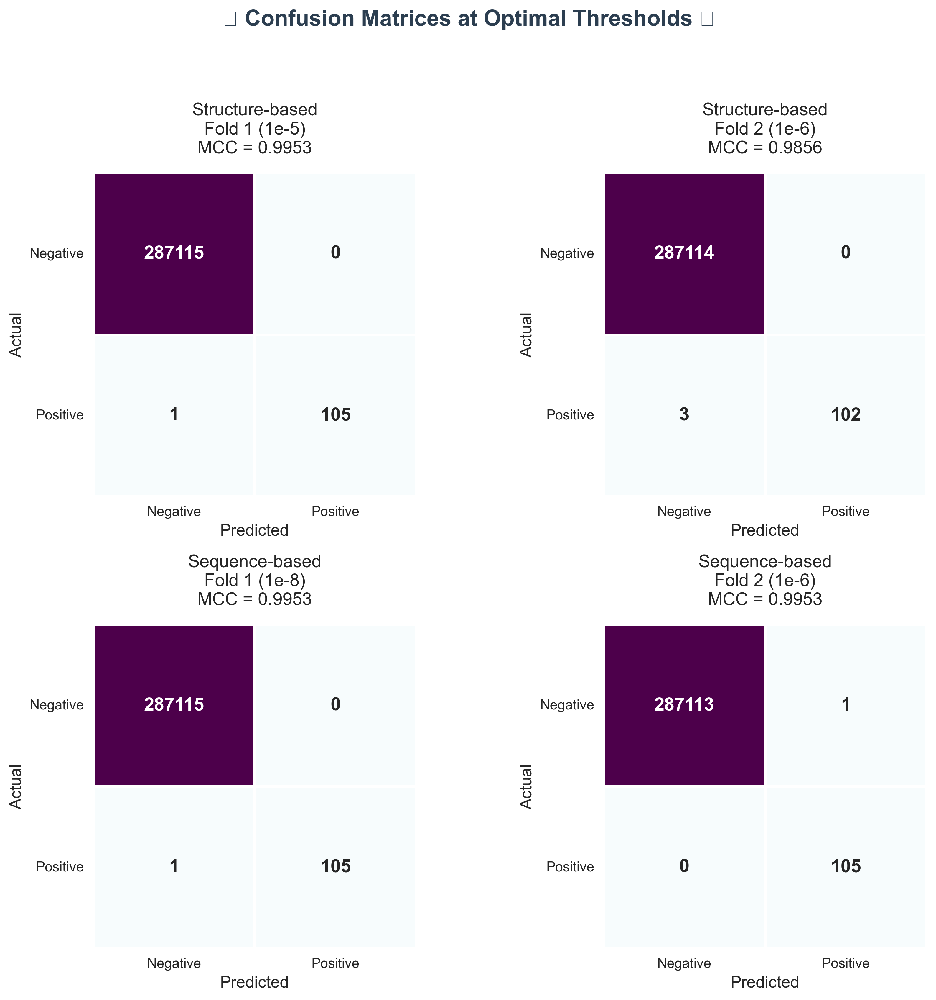
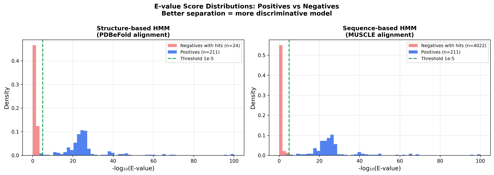

# 🧬 Profile HMM Detection of Kunitz-Type Protease Inhibitor Domains (PF00014)


> Building and comparing **structure-based** vs **sequence-based** Profile Hidden Markov Models for Kunitz/BPTI-type protease inhibitor domain (Pfam PF00014) detection, evaluated by 2-fold cross-validation on Swiss-Prot data.

---

## 📋 Table of Contents

- [Overview](#overview)
- [Repository Structure](#repository-structure)
- [Methodology](#methodology)
- [Results](#results)
- [Installation](#installation)
- [Reproducing the Pipeline](#reproducing-the-pipeline)
- [Data Availability](#data-availability)

---

## 📌 Overview

This project constructs two Profile HMMs for detecting the Kunitz/BPTI-type protease inhibitor domain:

| Model | Alignment Source | Seeds | Tool |
|-------|-----------------|-------|------|
| **Structure-based** | PDBeFold structural superposition (SSM) | 24 PDB chains (Pfam PF00014, ≤3.5 Å, 45–80 aa) | PDBeFold → `hmmbuild` |
| **Sequence-based** | MUSCLE multiple sequence alignment | 206 Swiss-Prot Kunitz domain sequences | MUSCLE → `hmmbuild` |

Both models are evaluated on the same Swiss-Prot positive/negative datasets using **2-fold cross-validation**, with MCC as the primary metric.

### Key Finding

Both models achieve near-perfect classification (peak MCC ~0.99), but the **structure-based HMM reaches zero false positives at a 1,000× less strict threshold** (1e-5 vs 1e-8), demonstrating that structural information produces more discriminative E-value separation between true Kunitz domains and non-Kunitz proteins.

---

## 📁 Repository Structure

```
HMM_KunitzDomain/
│
├── Data/
│   ├── Raw/
│   │   ├── pdb_ids.txt                    # 130 PDB IDs used (Pfam PF00014, ≤3.5Å, 45–80aa)
│   │   └── kunitz_pdb_nr90.fasta          # 35 chains after CD-HIT 90% clustering
│   │
│   └── Processed/
│       ├── pdb_kunitz_nr_clean.ali        # ★ Structure-based alignment (PDBeFold SSM, 24 chains)
│       ├── seq_domains_aln.ali            # ★ Sequence-based alignment (MUSCLE, 206 domains)
│       ├── structure_based.hmm            # ★ Structure-based Profile HMM (LENG=58, NSEQ=24)
│       ├── sequence_based.hmm             # ★ Sequence-based Profile HMM (LENG=58, NSEQ=206)
│       ├── kunitz_true_seeds.fasta        # 24 true Kunitz domain sequences (PDBeFold seeds)
│       ├── kunitz_domains_swssprot.fasta  # 206 Swiss-Prot Kunitz domain subsequences
│       └── contaminated_ids.txt           # 8 Swiss-Prot entries removed (≥95% identity to PDB seeds)
│
├── Scripts/
│   ├── performance.py                     # Confusion matrix, MCC, TPR, PPV, FPR computation
│   ├── build_class_files.py               # Merge hmmsearch outputs → .class files
│   ├── extract_kunitz_domains.py          # Extract Kunitz domain coordinates from hmmsearch domtbl
│   ├── MCC_vs_Evalue_Plot.ipynb           # Figure: MCC curves for both models across thresholds
│   ├── Confusion_Matrix_Table.ipynb       # Figure: Confusion matrices at optimal threshold
│   └── Evalue_Distribution_Plot.ipynb     # Figure: E-value score distributions
│
├── Results/
│   ├── all_performance_results.txt        # Full MCC/TPR/PPV/FPR sweep (all thresholds)
│   └── Figures/
│       ├── Figure_MCC_vs_Evalue.png       # MCC curves: structure-based vs sequence-based
│       ├── Figure_Confusion_Matrices.png  # Confusion matrices at optimal threshold
│       ├── Figure_Evalue_Distributions.png    # Score separation histograms
│       └── Figure_Evalue_Folds_Comparison.png # Fold consistency comparison
│
├── environment.yml                        # Conda environment specification
├── .gitignore
└── README.md
```

Files marked ★ are the core scientific deliverables — the alignments and trained HMMs.

---

## 🔬 Methodology

### 1. Data Preparation

**Positive set** — UniProtKB/Swiss-Prot (release 2025_03):
- Annotated with Pfam PF00014, InterPro IPR036880, or Prosite PS00280/PS50279
- Queried separately for human (`organism_id:9606`) and non-human
- 211 sequences after CD-HIT clustering at 90% identity
- 8 sequences removed by BLASTp contamination filter (≥95% identity to PDB seeds)
- Final: **203 clean positives** split into 2 folds (`pos_1.fasta`, `pos_2.fasta`)

**Negative set** — All Swiss-Prot entries lacking Kunitz annotations (~287K sequences), split into `neg_1.fasta`, `neg_2.fasta`

**PDB structures** — Pfam PF00014, resolution ≤3.5 Å, chain length 45–80 aa:
- 130 PDB entries downloaded from RCSB
- CD-HIT clustering at 90% → 35 representative chains (`kunitz_pdb_nr90.fasta`)
- PDBeFold structural superposition → 24 true Kunitz chains for structural alignment

### 2. Structure-Based HMM

```bash
# Structural alignment performed manually via PDBeFold (SSM)
# → pdb_kunitz_nr_clean.ali (24 sequences, LENG=58)
hmmbuild Data/Processed/structure_based.hmm Data/Processed/pdb_kunitz_nr_clean.ali
```

### 3. Sequence-Based HMM

```bash
# Use structure_based.hmm to locate domain coordinates in Swiss-Prot positives
# (generates Data/Processed/domain_hits.tbl used by extract_kunitz_domains.py)
hmmsearch --domtblout Data/Processed/domain_hits.tbl --max -Z 1000 \
          Data/Processed/structure_based.hmm Data/Processed/ok_kunitz_clean.fasta

# Extract domain-only subsequences (45–100 aa) from full Swiss-Prot sequences
python3 Scripts/extract_kunitz_domains.py

# Align domain sequences with MUSCLE
muscle -in Data/Processed/kunitz_domains_swssprot.fasta \
       -out Data/Processed/seq_domains_aln.ali -clwstrict

# Build sequence-based HMM
hmmbuild Data/Processed/sequence_based.hmm Data/Processed/seq_domains_aln.ali
```

### 4. HMM Search (2-fold cross-validation)

```bash
# 8 searches total: 2 models × 2 folds × (pos + neg)
for fold in 1 2; do
    hmmsearch -Z 1000 --max --tblout Data/Processed/struct_pos_${fold}.out \
              Data/Processed/structure_based.hmm Data/Processed/pos_${fold}.fasta
    hmmsearch -Z 1000 --max --tblout Data/Processed/struct_neg_${fold}.out \
              Data/Processed/structure_based.hmm Data/Processed/neg_${fold}.fasta
    hmmsearch -Z 1000 --max --tblout Data/Processed/seq_pos_${fold}.out \
              Data/Processed/sequence_based.hmm Data/Processed/pos_${fold}.fasta
    hmmsearch -Z 1000 --max --tblout Data/Processed/seq_neg_${fold}.out \
              Data/Processed/sequence_based.hmm Data/Processed/neg_${fold}.fasta
done
```

### 5. Performance Evaluation

```bash
# Build .class files (format: ID label E-value)
# Sequences with no hit are assigned E-value = 10
python3 Scripts/build_class_files.py

# Sweep E-value thresholds 10⁻¹ → 10⁻¹²
for model in struct seq; do
    for fold in 1 2; do
        for i in $(seq 1 12); do
            python3 Scripts/performance.py \
                Data/Processed/${model}_set_${fold}.class 1e-$i
        done
    done
done
```

---

## 📊 Results

### MCC at Key Thresholds

| Threshold | Struct Fold 1 | Struct Fold 2 | Seq Fold 1 | Seq Fold 2 |
|-----------|:------------:|:-------------:|:----------:|:----------:|
| 1e-3      | 0.9768       | 0.9812        | 0.9643     | 0.9726     |
| 1e-4      | 0.9859       | 0.9714        | 0.9816     | 0.9770     |
| **1e-5**  | **0.9953** ✅ | 0.9808       | 0.9859     | 0.9906     |
| **1e-6**  | 0.9953       | **0.9856** ✅ | 0.9906     | **0.9953** ✅ |
| 1e-8      | 0.9905       | 0.9808        | **0.9953** ✅ | 0.9952  |

### Structure-based HMM — Optimal Performance

| | Fold 1 | Fold 2 |
|--|--------|--------|
| **Peak MCC** | 0.9953 | 0.9856 |
| **Optimal threshold** | 1e-5 | 1e-6 |
| **FP at optimal** | **0** | **0** |
| **TPR** | 0.9906 | 0.9714 |
| **PPV** | 1.0000 | 1.0000 |

### Sequence-based HMM — Optimal Performance

| | Fold 1 | Fold 2 |
|--|--------|--------|
| **Peak MCC** | 0.9953 | 0.9953 |
| **Optimal threshold** | 1e-8 | 1e-6 |
| **FP at optimal** | **0** | **1** |
| **TPR** | 0.9906 | 1.0000 |
| **PPV** | 1.0000 | 0.9906 |

### Key Figures

| Figure | Description |
|--------|-------------|
|  | MCC curves for both models |
|  | Confusion matrices at optimal threshold |
|  | E-value score distributions |

### Scientific Conclusion

Both models achieve near-perfect classification (MCC ~0.99), but the **structure-based HMM demonstrates superior discriminative power**: it achieves zero false positives at threshold 1e-5, while the sequence-based model requires the 1,000× stricter threshold of 1e-8 to achieve the same. Additionally, the structure-based model assigns significantly lower (more extreme) E-values to true Kunitz sequences (min 8.6e-194 vs 7.5e-101), reflecting a more confident and specific detection profile. This confirms that incorporating 3D structural information produces a more discriminative Profile HMM.

The few remaining false negatives (1–3 per fold) are likely genuine Kunitz domains not yet annotated in Swiss-Prot — a known database incompleteness issue documented in the Pfam literature.

---

## ⚙️ Installation

```bash
git clone https://github.com/neginnilforosh/HMM_KunitzDomain.git
cd HMM_KunitzDomain
conda env create -f environment.yml
conda activate hmm-kunitz
```

**External tools required:** HMMER ≥ 3.3, MUSCLE v3 or v5, CD-HIT ≥ 4.8, BLAST+ ≥ 2.12

---

## 🔁 Reproducing the Pipeline

### Step 1 — Download raw data

```bash
# Positive set from UniProt (PF00014, reviewed)
# Human:     https://www.uniprot.org/uniprotkb?query=(database:pfam+PF00014)+AND+reviewed:true+AND+organism_id:9606
# Non-human: https://www.uniprot.org/uniprotkb?query=(database:pfam+PF00014)+AND+reviewed:true+NOT+organism_id:9606
# Negative:  https://www.uniprot.org/uniprotkb?query=reviewed:true+NOT+(database:pfam+PF00014)
# → Save as: Data/Raw/human_kunitz.fasta, Data/Raw/nothuman_kunitz.fasta, Data/Raw/human_notkunitz.fasta

# PDB structures — use pdb_ids.txt with RCSB batch download
# https://www.rcsb.org/downloads → paste contents of Data/Raw/pdb_ids.txt → select PDB format
# → Save all .pdb files to: Data/Raw/pdb_structures/
```

### Step 2 — Process and cluster positive set

```bash
# Combine human and non-human Kunitz sequences
cat Data/Raw/human_kunitz.fasta Data/Raw/nothuman_kunitz.fasta > Data/Raw/all_kunitz.fasta

# Cluster at 90% identity with CD-HIT
cd-hit -i Data/Raw/all_kunitz.fasta -o Data/Processed/ok_kunitz.fasta -c 0.90 -n 5

# BLASTp contamination filter — remove sequences ≥95% identical to PDB seeds
makeblastdb -in Data/Processed/kunitz_true_seeds.fasta -dbtype prot -out Data/Raw/seeds_db
blastp -query Data/Processed/ok_kunitz.fasta -db Data/Raw/seeds_db \
       -outfmt 6 -out Data/Raw/blast_results.txt -evalue 1e-3
awk '$3 >= 95 {print $1}' Data/Raw/blast_results.txt | sort -u > Data/Processed/contaminated_ids.txt

# Remove contaminated sequences
python3 -c "
from Bio import SeqIO
contaminated = set(open('Data/Processed/contaminated_ids.txt').read().split())
records = [r for r in SeqIO.parse('Data/Processed/ok_kunitz.fasta', 'fasta')
           if r.id not in contaminated]
SeqIO.write(records, 'Data/Processed/ok_kunitz_clean.fasta', 'fasta')
print(f'Kept {len(records)} sequences after contamination removal')
"

# Split into 2 folds (positives)
python3 -c "
from Bio import SeqIO
records = list(SeqIO.parse('Data/Processed/ok_kunitz_clean.fasta', 'fasta'))
SeqIO.write(records[::2],  'Data/Processed/pos_1.fasta', 'fasta')
SeqIO.write(records[1::2], 'Data/Processed/pos_2.fasta', 'fasta')
print(f'pos_1: {len(records[::2])} | pos_2: {len(records[1::2])}')
"

# Split into 2 folds (negatives)
python3 -c "
from Bio import SeqIO
records = list(SeqIO.parse('Data/Raw/human_notkunitz.fasta', 'fasta'))
SeqIO.write(records[::2],  'Data/Processed/neg_1.fasta', 'fasta')
SeqIO.write(records[1::2], 'Data/Processed/neg_2.fasta', 'fasta')
print(f'neg_1: {len(records[::2])} | neg_2: {len(records[1::2])}')
"
```

### Step 3 — Build HMMs

```bash
# Structure-based HMM — alignment already provided
hmmbuild Data/Processed/structure_based.hmm Data/Processed/pdb_kunitz_nr_clean.ali

# Sequence-based HMM — extract domain regions from Swiss-Prot positives
# Step 3a: locate domain coordinates using the structure-based HMM
hmmsearch --domtblout Data/Processed/domain_hits.tbl --max -Z 1000 \
          Data/Processed/structure_based.hmm Data/Processed/ok_kunitz_clean.fasta

# Step 3b: extract domain subsequences (reads domain_hits.tbl automatically)
python3 Scripts/extract_kunitz_domains.py

# Step 3c: align with MUSCLE and build HMM
muscle -in Data/Processed/kunitz_domains_swssprot.fasta \
       -out Data/Processed/seq_domains_aln.ali -clwstrict
hmmbuild Data/Processed/sequence_based.hmm Data/Processed/seq_domains_aln.ali
```

### Step 4 — Run hmmsearch (8 searches total)

```bash
for fold in 1 2; do
    hmmsearch -Z 1000 --max --tblout Data/Processed/struct_pos_${fold}.out \
              Data/Processed/structure_based.hmm Data/Processed/pos_${fold}.fasta
    hmmsearch -Z 1000 --max --tblout Data/Processed/struct_neg_${fold}.out \
              Data/Processed/structure_based.hmm Data/Processed/neg_${fold}.fasta
    hmmsearch -Z 1000 --max --tblout Data/Processed/seq_pos_${fold}.out \
              Data/Processed/sequence_based.hmm Data/Processed/pos_${fold}.fasta
    hmmsearch -Z 1000 --max --tblout Data/Processed/seq_neg_${fold}.out \
              Data/Processed/sequence_based.hmm Data/Processed/neg_${fold}.fasta
done
```

### Step 5 — Evaluate performance

```bash
# Build .class files (format: ID label E-value; undetected sequences get E-value=10)
python3 Scripts/build_class_files.py

# Sweep E-value thresholds 10⁻¹ → 10⁻¹²
for model in struct seq; do
    for fold in 1 2; do
        for i in $(seq 1 12); do
            python3 Scripts/performance.py \
                Data/Processed/${model}_set_${fold}.class 1e-$i
        done
    done
done
```

### Step 6 — Generate figures

```bash
jupyter notebook Scripts/MCC_vs_Evalue_Plot.ipynb
jupyter notebook Scripts/Confusion_Matrix_Table.ipynb
jupyter notebook Scripts/Evalue_Distribution_Plot.ipynb
```

---

## 📂 Data Availability

Large files are excluded from this repository due to size constraints. They can be retrieved as follows:

| File | Source | Query |
|------|--------|-------|
| `human_kunitz.fasta` | UniProtKB | `(database:pfam PF00014) AND reviewed:true AND organism_id:9606` |
| `nothuman_kunitz.fasta` | UniProtKB | `(database:pfam PF00014) AND reviewed:true NOT organism_id:9606` |
| `human_notkunitz.fasta` | UniProtKB | `reviewed:true NOT (database:pfam PF00014)` |
| PDB structures | RCSB batch | IDs in `Data/Raw/pdb_ids.txt` |

The trained HMMs (`structure_based.hmm`, `sequence_based.hmm`) and both alignments are included and can be used directly for Kunitz domain detection without re-running the full pipeline.

---
